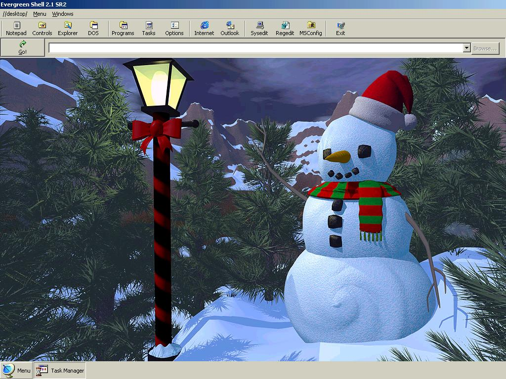

<div align="center">

## Evergreen Shell 2\.1


</div>

### Description

This code is intended as a replacement shell for Windows. It contains the functions that many people use.
 
### More Info
 
An error message will pop up stating that a background picture needs to be set. Click the Windows Menu and go to Options - it's self-explanatory from there.

You need to make sure you are running in 1024x768 resolution with 16 or 24 bit color. The icons look ugly in 32 bit color.


<span>             |<span>
---                |---
**Submitted On**   |2001-02-04 14:27:16
**By**             |[Jake \(Evergreen98\)](https://github.com/Planet-Source-Code/PSCIndex/blob/master/ByAuthor/jake-evergreen98.md)
**Level**          |Intermediate
**User Rating**    |4.7 (33 globes from 7 users)
**Compatibility**  |VB 5\.0, VB 6\.0
**Category**       |[Complete Applications](https://github.com/Planet-Source-Code/PSCIndex/blob/master/ByCategory/complete-applications__1-27.md)
**World**          |[Visual Basic](https://github.com/Planet-Source-Code/PSCIndex/blob/master/ByWorld/visual-basic.md)
**Archive File**   |[CODE\_UPLOAD14525242001\.zip](https://github.com/Planet-Source-Code/jake-evergreen98-evergreen-shell-2-1__1-15009/archive/master.zip)

### API Declarations

```
'Included in the code and the BAS.
```


